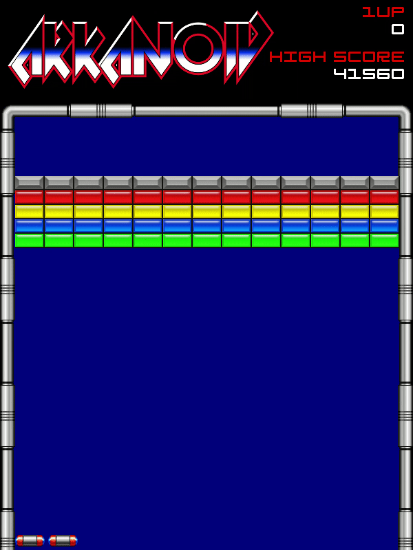
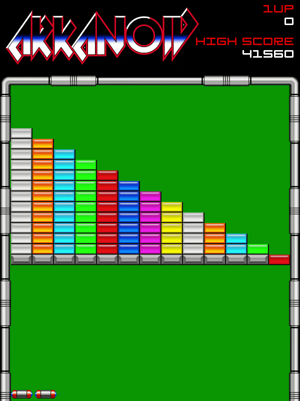
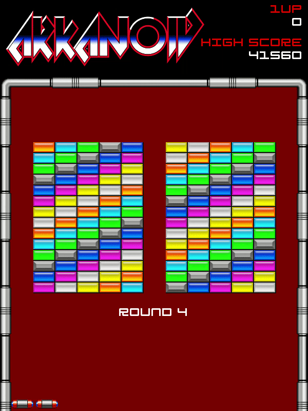

# Arkanoid

[](https://travis-ci.org/wkeeling/arkanoid)

I decided I would have a go at building a game using Python and [pygame](http://www.pygame.org/), and I chose the 1980's arcade classic, Arkanoid.

I've always enjoyed breakout-type games which are addictive and satisfying to play, and Arkanoid with its varying brick layouts, powerups and enemies adds some extra fun and depth to both the gameplay and code design.

Being new to pygame, I started out by reading the tutorials, one of which helpfully uses Pong [as an example](http://www.pygame.org/docs/tut/tom/MakeGames.html). This enabled me to get a headstart with the basic paddle and ball concepts which I was then able to build upon.

This implementation of Arkanoid is still work in progress. The following sequences of the first 4 levels give you an idea of how it looks.

## Start


## Round 1



## Round 2



## Round 3


## Round 4



## Installation

Arkanoid runs on Python 3 and requires pygame, plus a few system-wide dependencies.

### On Ubuntu 16.04

Install virtualenv if not already installed:

```
sudo apt install virtualenv
```

Create a virtualenv, with python 3 as the default python version:

```
virtualenv -p /usr/bin/python3 environments/arkanoid
```

Activate the virtualenv:

```
source environments/arkanoid/bin/activate
```

Install the system-wide dependencies for python3-dev:

```
sudo apt install python3-dev
```

Install the system-wide build dependencies for pygame:

```
sudo apt build-dep python-pygame
```

**NOTE:** If the above command generates a message saying **E: You must put some 'source' URIs in your sources.list**, then edit `/etc/apt/sources.list` and uncomment the lines that start `deb-src`. Save the file, then run `sudo apt update`. Now re-run the previous "build-dep" command.

Install other system-wide dependencies:

```
sudo apt install libfreetype6-dev mercurial
```
(mercurial is needed for building pygame from source)

Clone the arkanoid project:

```
git clone https://github.com/wkeeling/arkanoid.git
```

Install the project specific dependencies (will build pygame from source):

```
cd arkanoid; pip install -r requirements.txt
```

Run the game:

```
python arkanoid.py
```

Use the left and right arrow keys to control the paddle, and the spacebar to fire the laser and release caught balls.


## Credits
* [The Spriters Resource](http://www.spriters-resource.com/) for the majority of the graphics.
* [Positech Games](http://www.positech.co.uk/content/explosion/explosiongenerator.html) for the enemy explosion graphics.
* [Geronimo](http://www.dafont.com/paradox-fontworks.d5233) for the Generation font used in the game.
* [Pixel Sagas](http://www.dafont.com/optimus.font) for the Optimus font used in the game.
* [pygame-text](https://github.com/cosmologicon/pygame-text) for text drawing functions.
* Taito Corporation for the original Arkanoid game.

## Author

Will Keeling
